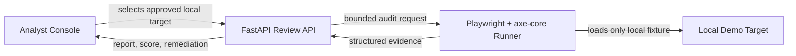

# A11yPulse Architecture

## Product Boundary

A11yPulse is an **on-demand quality-review workspace** for development teams. Its first release evaluates only two bundled local demonstration pages and an explicitly configured local target. It does not crawl websites, accept arbitrary internet URLs, authenticate to systems, retain credentials, submit forms, mutate data, or run continuously in the background.

## Execution Flow

The target selector is an enum rather than a URL field. The FastAPI service resolves the enum to a local route, then invokes a Node runner that launches Chromium through Playwright and obtains automatically detectable findings through `@axe-core/playwright`. The API adds narrowly scoped quality signals: successful response status, a non-empty document title, declared page language, heading structure, and keyboard-focus indicators.

## Evidence Model

Each report contains a generated audit identifier, approved target label, execution timestamp, high-level quality score, accessibility score, quality score, summary counts, and individual findings. A finding records its check ID, severity, WCAG-oriented tags when supplied by axe, a human-readable explanation, a DOM target, and a specific remediation prompt. Results are **review evidence**, not a legal or certification claim.

## Local-First Decision

| Option | Trade-off | Cost | Setup complexity |
|---|---|---:|---|
| **Local on-demand audits — selected for the first release** | Safe, deterministic, fast to demo, and suitable for developer review; it does not continuously monitor production URLs. | No external service required. | Low. |
| CI-integrated team audits — documented extension** | Enables pull-request feedback against a team-owned preview environment; requires an allowlist and CI environment configuration. | Uses the team’s CI capacity. | Medium. |
| Always-on external monitoring | Provides scheduled status visibility but adds target authorization, credential, rate-limit, privacy, and hosting requirements. | Ongoing hosting cost. | High. |

The first release uses the local on-demand path. Its report schema and API remain intentionally suitable for a future CI integration, but no schedule or background worker is included.
